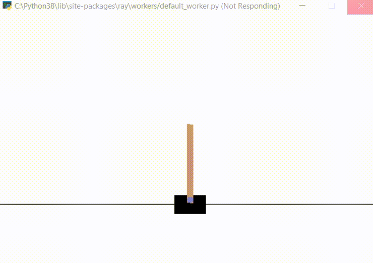
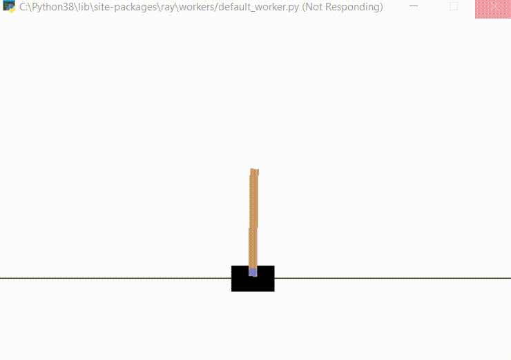
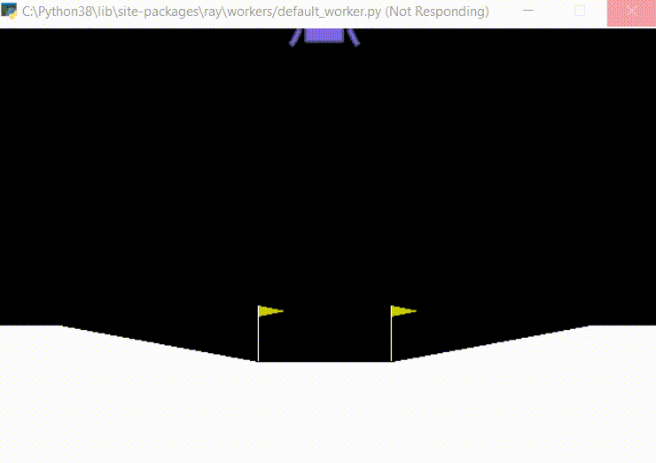
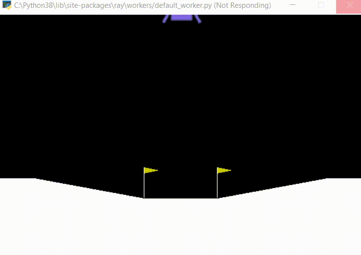

# MuZero Experiments 🤖

In 2016, Deepmind introduced [AlphaGo](https://deepmind.com/research/case-studies/alphago-the-story-so-far), the first artificial intelligence (AI) program to defeat humans at the ancient game of Go. Two years later, its successor - [AlphaZero](https://deepmind.com/blog/article/alphazero-shedding-new-light-grand-games-chess-shogi-and-go) - learned from scratch to master Go, chess and shogi. Now, in a paper we choose to study, [Mastering Atari, Go, Chess and Shogi by Planning with a Learned Model](https://arxiv.org/pdf/1911.08265.pdf), Deepmind describes MuZero, a significant step forward in the pursuit of general-purpose algorithms. MuZero masters Go, chess, shogi and Atari without needing to be told the rules, thanks to its ability to plan winning strategies in unknown environments (credits to the excellent [Deepmind blog](https://deepmind.com/blog/article/muzero-mastering-go-chess-shogi-and-atari-without-rules)).

## Introduction and Disclaimer 🎓

This reprository is groups of methods to assess and compare DeepMind's MuZero algorithm.
It was created in the context of the MAP670C - Reinforcement Learning (2020-2021) course with l'Ecole Polytechnique.
The majority of the code was forked and adapted for demo from [MuZero General](https://github.com/werner-duvaud/muzero-general) and [AlphaZero for Connect4](https://github.com/jpbruneton/Alpha-Zero-algorithm-for-Connect-4-game).

## A set of demos and comparisons of MuZero 🔥

### CartPole and LunarLander 🚀

One of the most known games for assessing reinforcement learning algorithms is Cartpole, as described by Sutton anf Barto. A pole is attached by an un-actuated joint to a cart, which moves along a frictionless track. The system is controlled by applying a force of +1 or -1 to the cart. The pendulum starts upright, and the goal is to prevent it from falling over. A reward of +1 is provided for every time step that the pole remains upright. The episode ends when the pole is more than 15 degrees from vertical, or the cart moves more than 2.4 units from the center. The simulation we used was based on an [OpenAi gym environment](https://gym.openai.com/), CartPole-v0, which defines "solving the game" as getting average reward of 195.0 over 100 consecutive trials.

Here we are first showing on the left the performance of MuZero agent Naïve Agent on the game, and we can see clearly that is fails to hold the pole more than a few seconds, and this is even more true since MuZero doesn't have any priors on the rules of the game.

On the right, we observe a trained agent, and if the cartpole is not moving much, it is because MuZero is adjusting constantly and perfectly to the game. Even if the cartpole game is solvable without [any reinforcement learning technique](https://towardsdatascience.com/how-to-beat-the-cartpole-game-in-5-lines-5ab4e738c93f), it is still satisfying to see that MuZero, without any priors on the rules, is able to perfectly learn the behaviors of this baseline environment. The agent was trained with a fully connected network for several hours, and while we don't have access to the tensorboard metrics, we can see it mastering the game perfectly with [these hyperparameters](https://github.com/alexZajac/muzero_experiments/blob/master/muzero/games/cartpole.py#L33-L111). Note here that all the following tests were trained on Ubuntu with 16 GB RAM / Intel i7 / GTX 1050Ti Max-Q.

The second game we have assessed with MuZero is LunarLander. The previous game was important to test as a baseline, but this one is really important because the environment is similar to the one from an _Atari game_, with the same name. MuZero was the first of its family to really tackle Atari games so it was important for us to test it out. The environment is described as follows: A landing pad is always placed at the center. Coordinates are the first two numbers in state vector. Reward for moving from the top of the screen to landing pad and zero speed is about 100..140 points. If lander moves away from landing pad it loses a reward back. Episode finishes if the lander crashes or comes to rest, receiving additional -100 or +100 points. Each leg ground contact is +10. Firing main engine is -0.3 points each frame. Landing outside landing pad is possible. Fuel is infinite, so an agent can learn to fly and then land on its first attempt. Four discrete actions available: do nothing, fire left orientation engine, fire main engine, fire right orientation engine.. The simulation we used was based on an deterministic version of the [OpenAi gym environment](https://gym.openai.com/), LunarLander-v2, which defines "solving the game" as getting average reward of 200 points.

As before, we are first showing on the left the performance of MuZero agent Naïve Agent on the Lunarlander game, and we can witness the random moves that it takes to failing at landing on the launchpad.

On the right, we observe a trained agent, which diverges a bit at the beginning of the game, but is applying a real strategy to deviate from his base trajectory, in order to safely land on the launchpad. It was a big satisfaction to see it land between the yellow flags, as MuZero had no knwoledge on the environment dynamics, and as this game is part of the Atari family, it represents a big leap forward. The agent was also trained with a fully connected network for several hours, but obviously with [different hyperparameters](https://github.com/alexZajac/muzero_experiments/blob/master/muzero/games/lunarlander.py#L33-L112) than the ones of Cartpole.

### Board Games ♟️

### Comparison to AlphaZero and Minimax with alpha-beta pruning 🐍
